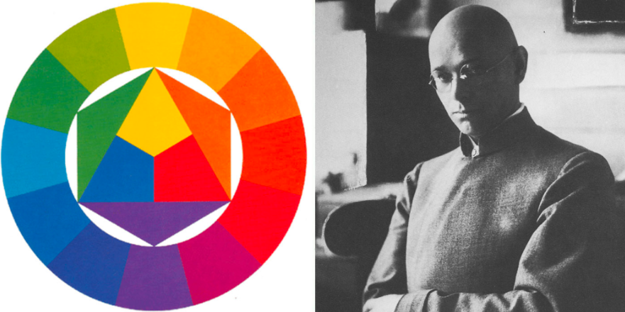

# Работа с цветом

<aside>
💡 **Notion Tip:** This page outlines why we conduct user research, and the processes we follow to ensure that user research sessions are successful.

</aside>

# Цветовой круг Иттена

Цветовой круг Иттена — это инструмент для подбора гармоничных цветовых сочетаний. Иттен утверждал, что органы чувств обрабатывают информацию через сравнение, поэтому мы оцениваем увиденное при помощи контрастов. И это касается не только контраста в размере объектов, но и контраста в цветовых сочетаниях. Важен не сам цвет, а то, в окражении каких оттенков он находится — от этого зависит восприятие цельной картинки. 

Комбинации на круге Иттена помогают подобрать оптимальные сочетания цветов. 

**Самые популярные комбнации по кругу Иттена**

# Сервисы для вдохновения цветом

## 1. [**https://color.adobe.com/ru/trends**](https://color.adobe.com/ru/trends)

Цветовые тренды в разных отраслях от творческих сообществ Behance и Adobe Stock

## 2. [**https://colors.combinations.obys.agency/**](https://colors.combinations.obys.agency/)

Потрясающий сайт про оттенки и градиенты

## 3. [**https://ru.pinterest.com/search/pins/?q=color palette&rs=typed**](https://ru.pinterest.com/search/pins/?q=color%20palette&rs=typed)

Пинтерест

## 4. [**https://ru.pinterest.com/search/pins/?q=color gradients&rs=typed**](https://ru.pinterest.com/search/pins/?q=color%20gradients&rs=typed)

Пинтерест про градиенты

[https://www.notion.so](https://www.notion.so)

# Сервисы для генерации палитр

## 1. [**https://www.sessions.edu/color-calculator/**](https://www.sessions.edu/color-calculator/)

Генерация палитры с помощью цветового круга

## 2. [**https://color.adobe.com/ru/create/color-wheel**](https://color.adobe.com/ru/create/color-wheel)

Генерация палитры с помощью цветового круга

## 3. [**https://0to255.com/**](https://0to255.com/)

Сервис, помогающий находить более светлые и темные оттенки вашего цвета. Полезно для выбора оттенков под ховеры, градиенты, обводки и т.д.

## 4. [**https://flatuicolors.com/**](https://flatuicolors.com/)

Готовые чистые UI палитры

[https://www.notion.so](https://www.notion.so)

## 5. [**https://colorhunt.co/**](https://colorhunt.co/)

Большая коллекция палитр, разбитая на удобные категории

## 6. [**http://colormind.io/template/paper-dashboard/**](http://colormind.io/template/paper-dashboard/)

Генерация и «примерка» палитры к дашборду или сайту

## 7. [**http://color-selector.com/?currentColor=549BCE**](http://color-selector.com/?currentColor=549BCE)

Создание палитры по фото

# Сервисы про градиенты

## 1. [**https://webgradients.com/**](https://webgradients.com/)

## 2. [**https://gradienthunt.com/**](https://gradienthunt.com/)

## 3. [**https://coolors.co/gradients**](https://coolors.co/gradients)

[https://www.notion.so](https://www.notion.so)

# Сервисы для проверки контрастности

## 1. [**https://color.adobe.com/ru/create/color-contrast-analyzer**](https://color.adobe.com/ru/create/color-contrast-analyzer)

Сервис от Adobe Color

## 2. [**https://www.siegemedia.com/contrast-ratio**](https://www.siegemedia.com/contrast-ratio)

# Плагины в Фигме для работы с цветом

## 1. **Плагин Color Palettes**

## [**https://www.figma.com/community/plugin/740832935938649295/Color-Palettes**](https://www.figma.com/community/plugin/740832935938649295/Color-Palettes)

Внутри огромное количество готовых, сбалансированных палитр

## 2. **Плагин** **Color Shades Kit**

## [**https://www.figma.com/community/plugin/1050457414903366814/Color-Shades-Kit**](https://www.figma.com/community/plugin/1050457414903366814/Color-Shades-Kit)

## 3. **Плагин** **Grainy Gradient**

## [**https://www.figma.com/community/plugin/1176149589166146593/Grainy-Gradient**](https://www.figma.com/community/plugin/1176149589166146593/Grainy-Gradient)

# Книга про теорию Цвета

## Иоханнес Иттен — Искусство цвета

Посмотреть/скачать: [https://disk.yandex.ru/i/DdehKOJrsoGNtQ](https://disk.yandex.ru/i/DdehKOJrsoGNtQ)

